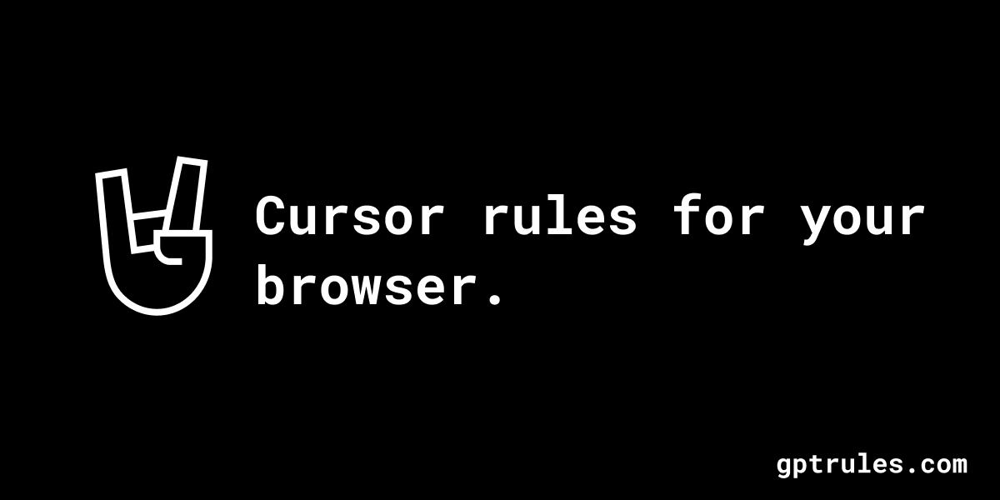

# GPT Rules

<p align="center">
  
</p>

## Demo

<p align="center">
  <video width="600" controls>
    <source src="images/demo.mp4" type="video/mp4">
    Your browser does not support the video tag.
  </video>
</p>

## Supercharge Your AI Chats with GPT Rules

Transform your AI experience with powerful shortcuts that save time and enhance results. GPT Rules brings Cursor-style prompting to your browser, letting you create custom commands for consistent, high-quality AI responses every time.

## Features

- **Custom Commands**: Create personalized shortcuts for your most common AI prompts
- **Cursor-Style Prompting**: Enjoy the power of Cursor's efficient prompting system right in your browser
- **Time-Saving**: Streamline your AI interactions with quick, consistent commands
- **Enhanced Results**: Get more reliable, high-quality responses from your AI assistant
- **Browser Integration**: Works seamlessly with your existing AI chat interfaces

## Installation

### Chrome Extension Installation (from dist folder)

1. Download or clone this repository to your local machine
2. Open Chrome and navigate to `chrome://extensions/`
3. Enable "Developer mode" by toggling the switch in the top right corner
4. Click on "Load unpacked" button
5. Browse to the repository location and select the `dist` folder
6. The GPT Rules extension should now appear in your extensions list
7. Click on the extension icon in your browser toolbar to start using GPT Rules

## Contributing

Contributions are welcome! Please feel free to submit a Pull Request.

## License

This project is licensed under the MIT License - see below for details:

```
MIT License

Copyright (c) 2023 GPT Rules

Permission is hereby granted, free of charge, to any person obtaining a copy
of this software and associated documentation files (the "Software"), to deal
in the Software without restriction, including without limitation the rights
to use, copy, modify, merge, publish, distribute, sublicense, and/or sell
copies of the Software, and to permit persons to whom the Software is
furnished to do so, subject to the following conditions:

The above copyright notice and this permission notice shall be included in all
copies or substantial portions of the Software.

THE SOFTWARE IS PROVIDED "AS IS", WITHOUT WARRANTY OF ANY KIND, EXPRESS OR
IMPLIED, INCLUDING BUT NOT LIMITED TO THE WARRANTIES OF MERCHANTABILITY,
FITNESS FOR A PARTICULAR PURPOSE AND NONINFRINGEMENT. IN NO EVENT SHALL THE
AUTHORS OR COPYRIGHT HOLDERS BE LIABLE FOR ANY CLAIM, DAMAGES OR OTHER
LIABILITY, WHETHER IN AN ACTION OF CONTRACT, TORT OR OTHERWISE, ARISING FROM,
OUT OF OR IN CONNECTION WITH THE SOFTWARE OR THE USE OR OTHER DEALINGS IN THE
SOFTWARE.
```
